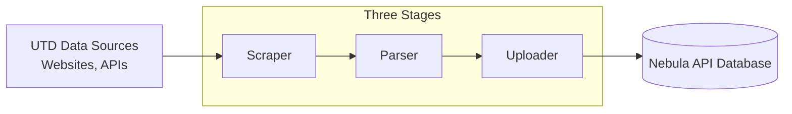

# Pipeline Architecture & Core Concepts

`api-tools` uses a simple, one-way data pipeline with several stages. Each stage has one clear job.
Understanding how these stages work together is important before adding or changing code.

---

## Project Pipeline

The lifecycle of data moving through `api-tools` follows a three-stage progression:

---

## The Three Core Components

### Scrapers (`scrapers/`)

- **What they do**: Connect to external UTD web servers, APIs, and portals to download raw information.
- **How they work**: Scrapers fetch data via:
  - Standard HTTP requests (`net/http`)
  - Web scraping via ([ChromeDP](https://github.com/chromedp/chromedp))
- **Key Principle**: **Scrapers do NOT validate or parse data.** Their sole job is to faithfully capture raw data from the source and save it to disk in the `data/` directory (e.g., `data/24f/cp_cs/cs1337.001.24f.html`).

---

### Parsers (`parser/`)

- **What they do**: Read raw files produced by scrapers alongside static reference files, extract meaningful fields, normalize inconsistent formatting, and assemble validated Go data structures.to
- **How they work**:
  - Parse HTML via Go tokenizers and CSS selectors (`golang.org/x/net/html`)
  - Cross-reference scraped data with static datasets (grade CSVs, budget PDFs)
  - Validate structs against the Nebula API schema via `parser/validator.go`
- **Key Principle**: Input files in `data/` are strictly **immutable**. Parsers must treat input files as read-only and never modify raw scraped data.

---

### Uploaders (`uploader/`)

- **What they do**: Take validated data models and push them to the [Nebula API](https://github.com/utdnebula/nebula-api) database (MongoDB).
- **How they work**:
  - Connect to MongoDB using the official [Go Mongo driver](`go.mongodb.org/mongo-driver`).
  - Support both **merge** operations (updating existing records with new fields) and **replace** operations (overwriting outdated datasets).
  - Compute static aggregation metrics where required before saving.
- **Key Principle**: Uploaders assume data passed to them has already been parsed and validated.

---

## Automation

Most data sources are updated automatically by web scrapers run through shell scripts (.sh). These scripts are scheduled to run regularly via cron jobs in Google Cloud. The scripts are located in `runners/`.

---

## Next Step

See [Project-Structure.md](Project-Structure.md)
