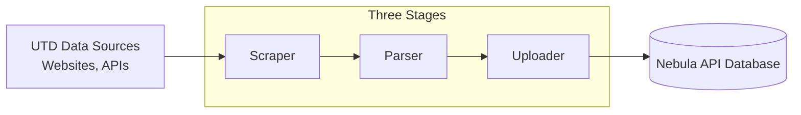

# Project Architecture

`api-tools` is a collection of tools used by [nebula-api](https://github.com/UTDNebula/nebula-api). Data is collected, processed, validated, and uploaded into the Nebula API. The data comes from various UTD data sources including coursebook, maps, events, and more. Many of these tools are self-contained and can be run directly from the command line. See the [README.md](/README.md) for instructions on running them.

Tools are written in Go. ADD GO REFERENCE!
<!-- TODO: ADD GO REFERNECES -->

## Project Pipeline

The lifecycle of data moving through `api-tools` follows a three-stage process:

### Scrapers (`scrapers/`)

Scrapers connect to external UTD web servers, APIs, and portals to download raw information. They capture raw data (`.html`, `.json`, etc.) and store it in the `data/` directory (e.g., `data/24f/cp_cs/cs1337.001.24f.html`).

Libraries used:

- `net/http`: Go Standard library HTTP client for fetching static pages and making REST API calls.
- [ChromeDP](https://github.com/chromedp/chromedp): Headless browser automation via the Chrome DevTools Protocol for scraping dynamic, JavaScript-rendered, or authenticated pages (WAT NetID login, Coursebook, Astra Schedule).
- [cdproto](https://github.com/chromedp/cdproto): Chrome DevTools Protocol definitions used for low-level network event handling, cookie extraction, and DOM interaction.
- [fastjson](https://github.com/valyala/fastjson): High-performance, zero-allocation JSON parser for reading large raw payloads (e.g., Astra room scheduling events).

### Parsers (`parser/`)

Parsers read raw files produced by scrapers, and non scraped data stored in (`static-data/`). They then extract meaningful fields, fix inconsistent formatting, and turn raw data into validated Go data structures matching our schema. Parsers do not modify input data.

Libraries used:

- [goquery](https://github.com/PuerkitoBio/goquery): jQuery-like DOM traversal and CSS selector querying for HTML documents (courses, sections, professors, degree requirements, discounts).
- [golang.org/x/net](https://pkg.go.dev/golang.org/x/net): Low-level HTML tokenization and atom lookup (`html/atom`) during section parsing.
- [google.golang.org/genai](https://pkg.go.dev/google.golang.org/genai): Google Gemini LLM client (Vertex AI / Gemini API) for structured schema-based extraction from unstructured documents (academic calendars and university budgets).
- [nebula-api/api](https://github.com/UTDNebula/nebula-api): Canonical data models (`api/schema`) used to structure and validate parsed data via `parser/validator.go`.
- [dongri/phonenumber](https://github.com/dongri/phonenumber): Phone number parsing and normalization for student discount programs.
- [golang.org/x/text](https://pkg.go.dev/golang.org/x/text): Unicode text transformation and casing rules (`cases`, `language`) for event names and titles.
- [google/go-cmp](https://github.com/google/go-cmp): Deep equality comparisons and struct diffing across unit and regression test suites.

### Uploaders (`uploader/`)

Uploaders take validated data models and push them to the Nebula API MongoDB database.

Libraries used:

- [go.mongodb.org/mongo-driver](https://pkg.go.dev/go.mongodb.org/mongo-driver): Official MongoDB driver (`mongo`, `bson`) for database connection management, BSON document serialization, bulk upserts, and aggregation pipelines.
- [nebula-api/api](https://github.com/UTDNebula/nebula-api): Shared schema definitions ensuring stored documents match Nebula API collection expectations.

## Automation

Most data sources are updated automatically through shell scripts that coordinate scraper, parser, and uploader execution. These scripts run in containerized environments scheduled by cron jobs in Google Cloud. The automation scripts are located in runners/.

Tools and Libraries used:

- **Bash (`runners/*.sh`)**: Command-line orchestration scripts that run end-to-end pipeline sequences for different data sources.
- **Docker**: Multi-stage container definitions providing reproducible execution environments across local and cloud runners.
- **Google Cloud Build & Cloud Scheduler**: Cloud CI/CD and cron scheduling services that trigger periodic pipeline executions.

## Lifecycle and workflow

We use several tools to aid in the development lifecycle and workflow:

- `testing`: Go standard library testing package for unit tests across the project.
- **GitHub Actions**: Runs automated CI workflows for PRs, and deploys API-Tools to Google Artifact Registry and Google Cloud Run jobs.
- [godotenv](https://github.com/joho/godotenv): Parses `.env` files and loads variables such as URIs and credentials at startup.
- [getsentry/sentry-go](https://github.com/getsentry/sentry-go): Production error tracking, panic handling, and trace sampling. Initialized in `main.go`, it captures unhandled runtime failures during scraper, parser, and uploader runs and flushes diagnostics to Sentry before exit.

## Next Step

See [Project-Structure.md](Project-Structure.md)
