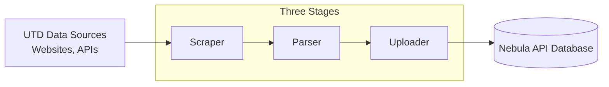

# Project-Architecture

`api-tools` is a collection of tools used by [nebula-api](https://github.com/UTDNebula/nebula-api). Data is collected, processed, validated, and uploaded to the Nebula API.

The data comes from various UTD data sources including courses, maps, events, and more. Many of these tools are self-contained and can be run directly from the command line. See the [README.md](/README.md) for instructions on running them.

Tools are written in Go. If you're new to Go (or just rusty), two good places to start are [A Tour of Go](https://go.dev/tour/list), which is interactive, runs in your browser, and needs no setup,
and [Effective Go](https://go.dev/doc/effective_go), which covers how to write Go the idiomatic way and is worth skimming before diving into `scrapers/`, `parser/`, or `uploader/`.

## Project Pipeline

Data moves through `api-tools` in three stages:

### Scrapers (`scrapers/`)

Scrapers connect to websites, APIs, and portals to download raw information. They capture raw data in `.html`, `.json`, or other formats, and store it in the `data/` directory. For example, a scrapped course would be found at `data/24f/cp_cs/cs1337.001.24f.html` after running the scraper.

For most scraping we use Go's built-in `net/http` library to directly make API requests and get our data. Sometimes we need a browser to recreate more complex actions. For automating browser actions, we use [ChromeDP](https://github.com/chromedp/chromedp) which uses Chrome DevTools. For extra scraping functionality not already covered by ChromeDP, we use [cdproto](https://github.com/chromedp/cdproto).

### Parsers (`parser/`)

Parsers read raw files produced by scrapers, and non scraped data stored in (`static-data/`). They then convert this data into a more machine-readable format.

For HTML documents like courses, sections, professors, degree requirements, and discounts, we use [goquery](https://github.com/PuerkitoBio/goquery). Goquery lets us navigate our `.html` files programmatically with selectors. For more unstructured documents like calendars and budgets, we use the Google Gemini [google.golang.org/genai](https://pkg.go.dev/google.golang.org/genai).

Everything gets structured and validated against the data models in [nebula-api/api](https://github.com/UTDNebula/nebula-api) (`api/schema`) via `parser/validator.go`.

### Uploaders (`uploader/`)

Uploaders take parsed data and upload it to the Nebula API MongoDB database.

We use the official [MongoDB driver](https://pkg.go.dev/go.mongodb.org/mongo-driver) to connect to the database, turn Go structs into BSON documents, write them in bulk, and run aggregation queries. The shared schema definitions come from [nebula-api/api](https://github.com/UTDNebula/nebula-api), so what we store always matches what the API expects to find.

## Cloud Automation

Most data sources are updated automatically through shell scripts in `runners/`. These scripts run in containerized environments in Google Cloud.

We use [Docker](https://www.docker.com/) to create a consistent environment to run `api-tools` in the cloud. We use [Google Cloud Build](https://cloud.google.com/build) to build our docker image, and [Google Cloud Scheduler](https://docs.cloud.google.com/scheduler/docs) to schedule our cloud pipeline runs.

## Other Imporatnt tools

We use several tools while developing the API.

Tests use Go's standard `testing` package for unit tests across the project.

We use [Sentry](https://github.com/getsentry/sentry-go) for error tracking.

We use [GitHub Actions](https://github.com/features/actions) to check Go code for PRs, deploy our Docker image, and deploy this Wiki!

## Supporting libraries

We use several supporting libraries for more minor things. Here is a list of most of them, and their purpose

- [fastjson](https://github.com/valyala/fastjson) - lets us read huge JSON payloads in scrapers without loading the whole thing into memory at once. It walks through the data piece by piece, which is how we handle things like the Astra room scheduling events.
- [dongri/phonenumber](https://github.com/dongri/phonenumber) - cleans up phone numbers from student discount programs. They show up in every format imaginable, so this gives us one consistent shape to store.
- [golang.org/x/text](https://pkg.go.dev/golang.org/x/text) - handles Unicode transformations and casing rules, which keeps event names and titles from getting mangled when they contain non-English characters.
- [google/go-cmp](https://github.com/google/go-cmp) - compares structs for our unit and regression tests, so when something breaks we can see exactly which field changed instead of just "not equal."
- [godotenv](https://github.com/joho/godotenv) - reads our `.env` files and loads things like URIs and credentials when the program starts, so we don't have to hardcode secrets or pass them on the command line.

## Next Step

See [Project-Structure.md](/docs/Project-Structure.md)
