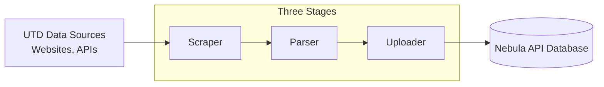

# Project-Architecture

`api-tools` is a collection of tools used by [nebula-api](https://github.com/UTDNebula/nebula-api). Data is collected, processed, validated, and uploaded to the Nebula API.

The data comes from various UTD data sources including coursebook, maps, events, and more. Many of these tools are self-contained and can be run directly from the command line. See the [README.md](/README.md) for instructions on running them.

Tools are written in Go. If you're new to Go (or just rusty), two good places to start are [A Tour of Go](https://go.dev/tour/list), which is interactive, runs in your browser, and needs no setup,
and [Effective Go](https://go.dev/doc/effective_go), which covers how to write Go the idiomatic way and is worth skimming before diving into `scrapers/`, `parser/`, or `uploader/`.

## Project Pipeline

Data moves through `api-tools` in three stages:

### Scrapers (`scrapers/`)

Scrapers connect to external UTD web servers, APIs, and portals to download raw information. They capture raw data (`.html`, `.json`, etc.)
and store it in the `data/` directory (e.g., `data/24f/cp_cs/cs1337.001.24f.html`).

For most scraping we use Go's built-in `net/http` library to directly make requests, which covers static pages and REST API calls.
Sometimes we need a browser, and for that we use [ChromeDP](https://github.com/chromedp/chromedp), which handles headless browser automation via the Chrome DevTools Protocol
and lets us scrape dynamic, JavaScript-rendered, or authenticated pages like WAT NetID login, Coursebook, and Astra Schedule.
For extra scraping functionality not already covered by ChromeDP, we use [cdproto](https://github.com/chromedp/cdproto),

### Parsers (`parser/`)

Parsers read raw files produced by scrapers, and non scraped data stored in (`static-data/`). They then extract meaningful fields, fix inconsistent formatting,
and turn raw data into validated Go data structures matching our schema. Parsers do not modify input data.

For HTML documents like courses, sections, professors, degree requirements, and discounts, we use [goquery](https://github.com/PuerkitoBio/goquery),
which gives us jQuery-like DOM traversal and CSS selector querying.
When we need low-level HTML tokenization and atom lookup during section parsing, we use [golang.org/x/net](https://pkg.go.dev/golang.org/x/net).
For structured schema-based extraction from unstructured documents like academic calendars and university budgets, we use the Google Gemini LLM client
[google.golang.org/genai](https://pkg.go.dev/google.golang.org/genai) (Vertex AI / Gemini API).
Everything gets structured and validated against the canonical data models in [nebula-api/api](https://github.com/UTDNebula/nebula-api) (`api/schema`) via `parser/validator.go`.

### Uploaders (`uploader/`)

Uploaders take validated data models and push them to the Nebula API MongoDB database.

We use the official [MongoDB driver](https://pkg.go.dev/go.mongodb.org/mongo-driver) to connect to the database, turn Go structs into BSON documents,
write them in bulk, and run aggregation queries. The shared schema definitions come from [nebula-api/api](https://github.com/UTDNebula/nebula-api),
so what we store always matches what the API expects to find.

## Supporting libraries

A few libraries don't fit neatly into any single stage of the pipeline, so they live here.

- [fastjson](https://github.com/valyala/fastjson) - lets us read huge JSON payloads in scrapers without loading the whole thing into memory at once. It walks through the data piece by piece, which is how we handle things like the Astra room scheduling events.
- [dongri/phonenumber](https://github.com/dongri/phonenumber) - cleans up phone numbers from student discount programs. They show up in every format imaginable, so this gives us one consistent shape to store.
- [golang.org/x/text](https://pkg.go.dev/golang.org/x/text) - handles Unicode transformations and casing rules, which keeps event names and titles from getting mangled when they contain non-English characters.
- [google/go-cmp](https://github.com/google/go-cmp) - compares structs for our unit and regression tests, so when something breaks we can see exactly which field changed instead of just "not equal."
- [godotenv](https://github.com/joho/godotenv) - reads our `.env` files and loads things like URIs and credentials when the program starts, so we don't have to hardcode secrets or pass them on the command line.

## Automation

Most data sources are updated automatically through shell scripts that coordinate scraper, parser, and uploader execution. These scripts run in
containerized environments scheduled by cron jobs in Google Cloud. The automation scripts are located in `runners/`.

The orchestration itself is plain Bash (`runners/*.sh`), which runs end-to-end pipeline sequences for different data sources.
**Docker** provides multi-stage container definitions for reproducible execution environments across local and cloud runners.
And **Google Cloud Build & Cloud Scheduler** handle the cloud CI/CD and cron scheduling that trigger periodic pipeline executions.

## Lifecycle and workflow

We use several tools while developing the API.

Tests use Go's standard `testing` package for unit tests across the project. **GitHub Actions** runs automated CI workflows for PRs
and deploys API-Tools to Google Artifact Registry and Google Cloud Run jobs. And [getsentry/sentry-go](https://github.com/getsentry/sentry-go) handles production error tracking,
panic handling, and trace sampling - it's initialized in `main.go`, captures unhandled runtime failures during scraper, parser, and uploader runs,
and flushes diagnostics to Sentry before exit.

## Next Step

See [Project-Structure.md](/docs/Project-Structure.md)
